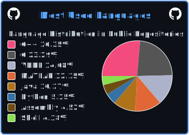

# Hello there 😁

My name is Robert and I am a graduate of the National & Kapodistrian University of Athens with a BSc in Economics (2018-2023).  
Currently I am an undergraduate Computer Engineer in the department of Computer Science and Engineering
at the University of West Attica (2023- ).  

I am particularly interested in 👀:  
• `Low-level programming`  
• `Electronic & Microelectronic circuits`  
• `Digital Electronics and Logic Design`  
• `Microcontrollers and Sensors`  

Here I will be uploading the projects and assignments I complete during my undergraduate years.  
Each course will be found in its own repository.  

